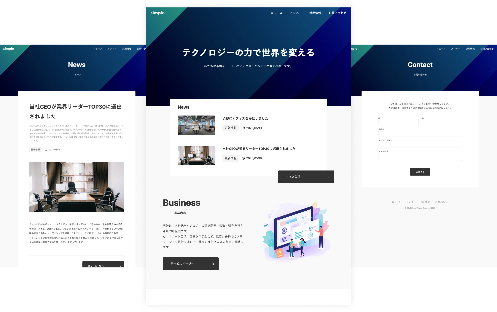
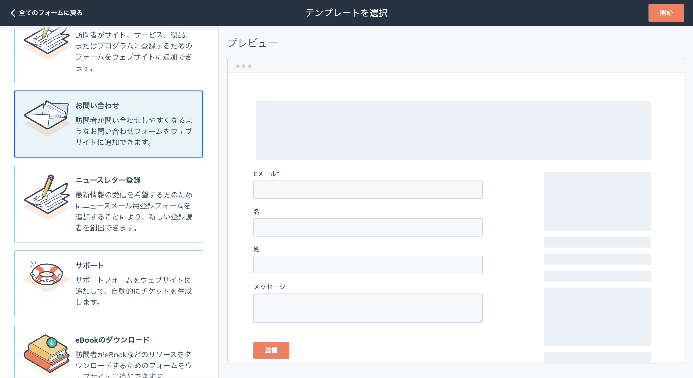
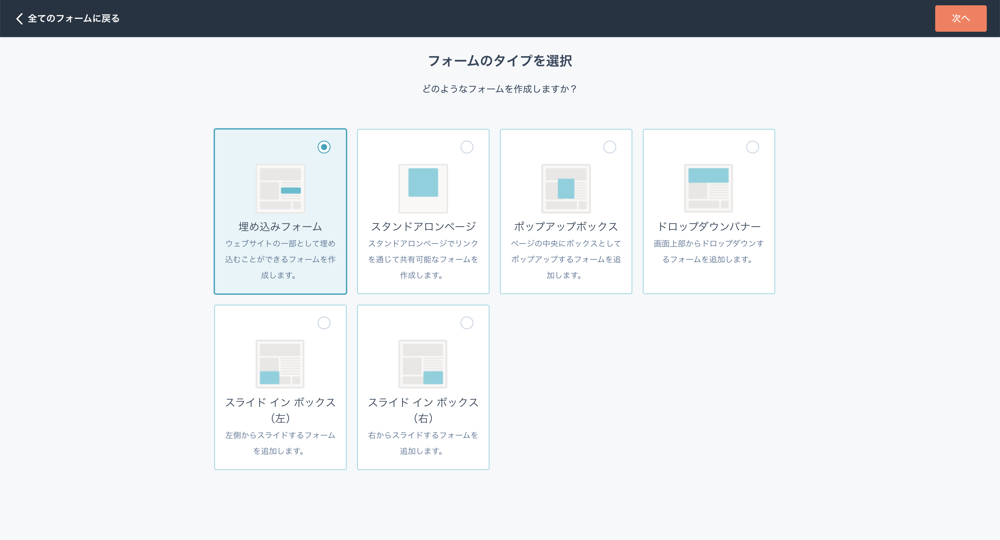
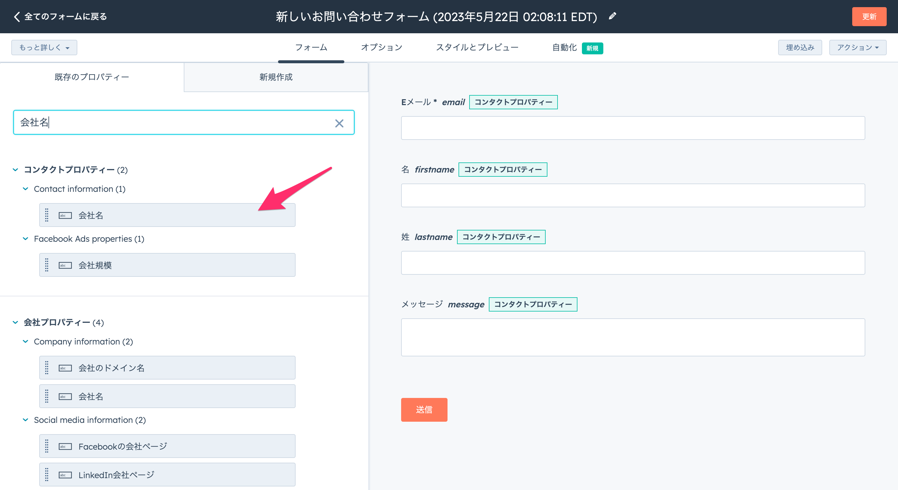
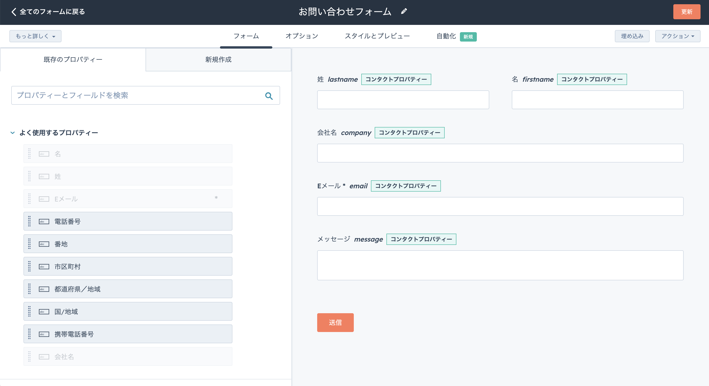
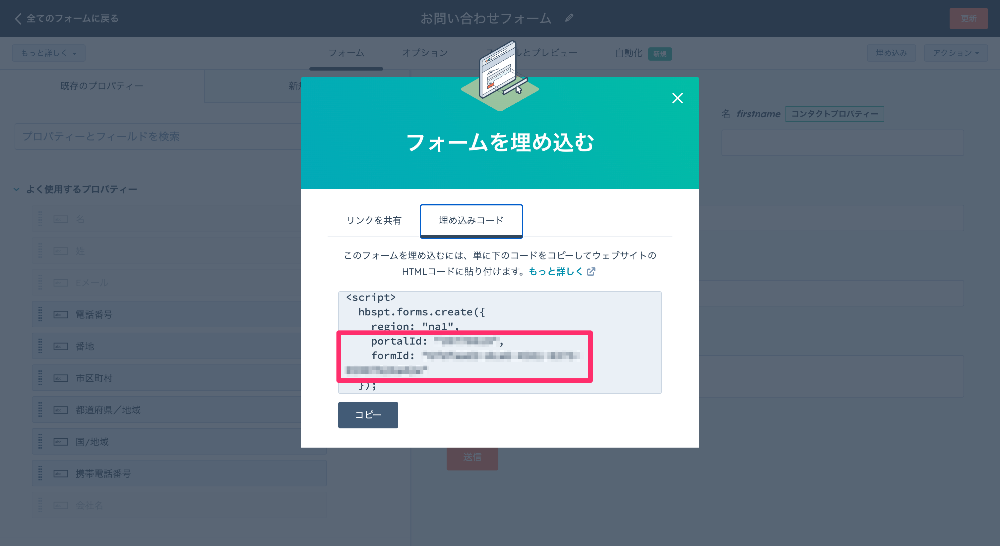

## シンプルなコーポレートサイト



microCMS 公式のシンプルなコーポレートサイトのテンプレートです。
サイト内のお問い合わせ送信先として CRM である [HubSpot](https://www.hubspot.jp/) を利用しています。

## 動作環境

Node.js 18 以上

## 環境変数の設定

ルート直下に`.env`ファイルを作成し、下記の情報を入力してください。

```
MICROCMS_API_KEY=xxxxxxxxxx
MICROCMS_SERVICE_DOMAIN=xxxxxxxxxx
BASE_URL=xxxxxxxxxx
HUBSPOT_PORTAL_ID=xxxxxxxx
HUBSPOT_FORM_ID=xxxxxxxx-xxxx-xxxx-xxxx-xxxxxxxxxxxx
```

`MICROCMS_API_KEY`  
microCMS 管理画面の「サービス設定 > API キー」から確認することができます。

`MICROCMS_SERVICE_DOMAIN`  
microCMS 管理画面の URL（https://xxxxxxxx.microcms.io）の xxxxxxxx の部分です。

`BASE_URL`
デプロイ先の URL です。プロトコルから記載してください。

例）  
開発環境 → http://localhost:3000  
本番環境 → https://xxxxxxxx.vercel.app/ など

`HUBSPOT_PORTAL_ID`
HubSpot のアカウント ID

`HUBSPOT_FORM_ID`
HubSpot のフォームに割り当てられる ID

## 開発の仕方

1. パッケージのインストール

```bash
npm install
```

2. 開発環境の起動

```bash
npm run dev
```

3. 開発環境へのアクセス  
   [http://localhost:3000](http://localhost:3000)にアクセス

## HubSpot の準備

お問い合わせの送信先として HubSpot の準備をしましょう。

1. 下記の公式ドキュメントより HubSpot アカウントのセットアップを行う

   [HubSpot アカウントをセットアップする](https://knowledge.hubspot.com/ja/get-started/set-up-your-account)

2. フォームを作成する

   「マーケティング > リード情報の収集 > フォーム」より、問い合わせを受け取るためのフォームを用意します。

   2-1. フォームのタイプを選択する

   埋め込みフォームを選択します。

   

   2-2. テンプレートを選択

   お問い合わせを選択します。

   

   2-3. フォームの項目を設定

   左のサイドバーにて「会社名」と検索し、コンタクトプロパティーの「会社名」フィールドを右側にドラック＆ドロップする。

   

   下記の項目を設定できたら完了です。

   - 姓：lastname
   - 名：firstname
   - 会社名：company
   - E メール：email
   - メッセージ：message

   

3. portalId と formId をコピーし、環境変数に設定する

   「埋め込み」ボタンをクリックすると埋め込みコードの表示ができます。
   その中に記載されている`portalId`と`formId`の値をコピーし、環境変数に設定します。

   

## Vercel へのデプロイ

[Vercel Platform](https://vercel.com/new?utm_medium=default-template&filter=next.js&utm_source=create-next-app&utm_campaign=create-next-app-readme)から簡単にデプロイが可能です。

リポジトリを紐付け、環境変数を `Environment Variables` に登録しましょう。
